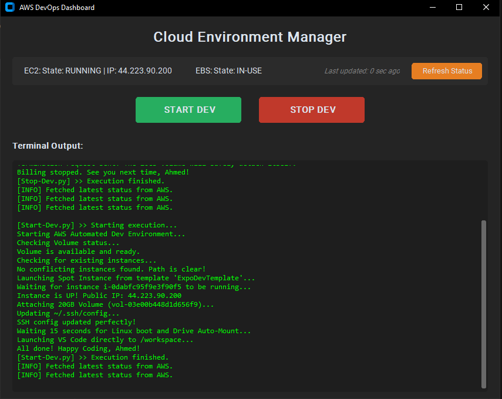
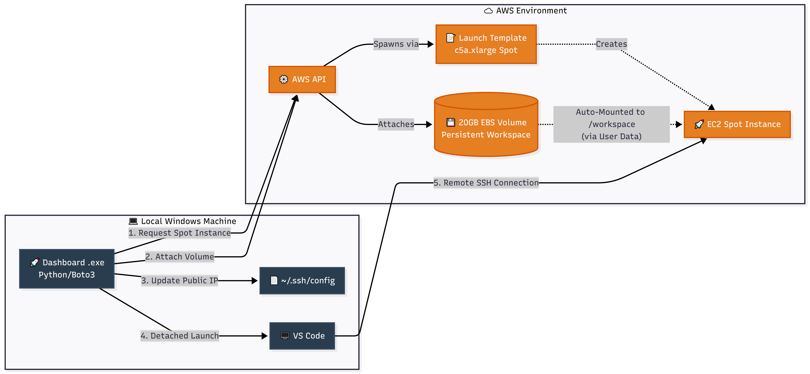
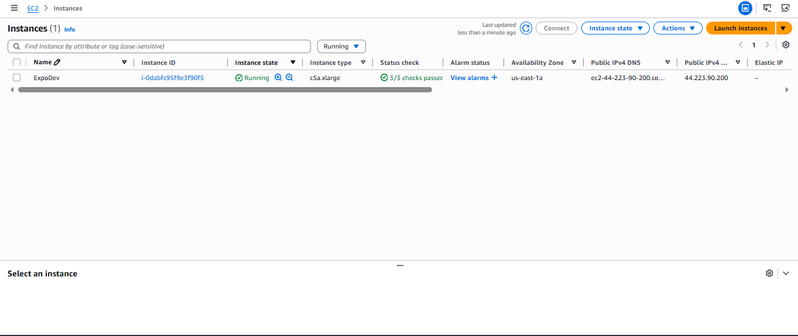
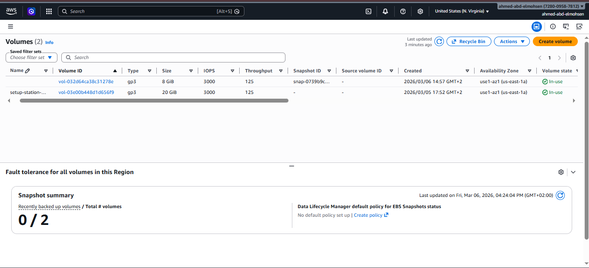
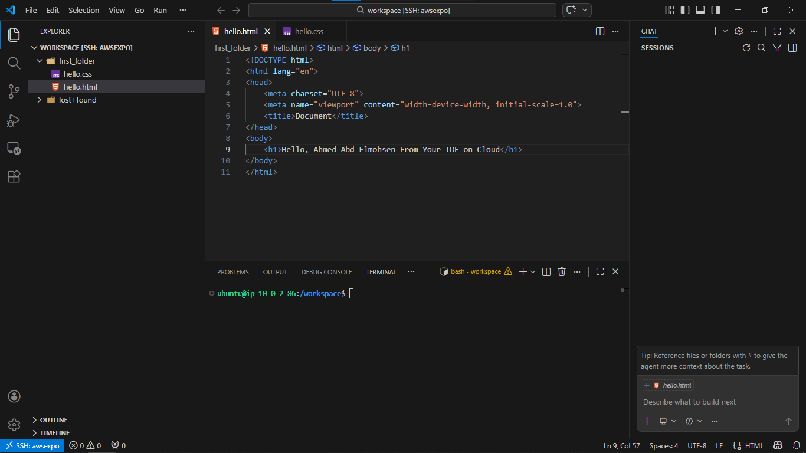

# AWS Automated Cloud Development Environment


A fully automated, cost-optimized Cloud Development Environment built with **Python, Boto3, and AWS EC2 Spot Instances**. The tool provisions an ephemeral remote workspace, attaches persistent storage, configures local SSH, and launches VS Code — all from a single click on a custom Windows GUI.

<p align="center">
  
</p>

---

## Background

Running On-Demand EC2 instances for day-to-day development is costly. On top of compute charges, assigning an Elastic IP to maintain a static connection adds an hourly fee ($0.005/hr) regardless of whether the instance is running — an unnecessary expense for a development workflow.

This project addresses both problems through a **Stateless Compute / Persistent Storage** architecture:

- **Compute** — EC2 Spot Instances (`c5a.xlarge`) reduce costs by 70–90% compared to On-Demand pricing.
- **Storage** — All project data lives on a detached, persistent 20GB EBS Volume that survives instance termination.
- **Networking** — Elastic IPs are eliminated entirely. On each launch, the script dynamically retrieves the instance's ephemeral public IP and rewrites the local `~/.ssh/config` automatically.

---

## Architecture & Workflow

Clicking the **Start Dev** button on the dashboard triggers the following sequence:



---

## Key Features

**Custom GUI Dashboard**
Built with `customtkinter`, the dark-mode interface lets you manage the full lifecycle of the environment without touching the AWS Console.

**Automated Spot Provisioning**
Instances are launched from a pre-configured AWS Launch Template that encodes the desired instance type, security groups, and IAM role.

**Dynamic Volume Attachment**
On every launch, the script locates the persistent EBS volume by ID and attaches it to the newly provisioned Spot Instance automatically.

**Auto-Mounting via User Data**
The EC2 instance runs a bash User Data script at boot that formats the volume (if it's new) and mounts it to `/workspace`, requiring no manual intervention.

**Local SSH Automation**
The `~/.ssh/config` file on the local Windows machine is rewritten on every launch with the current ephemeral public IP, so VS Code connects without any manual edits.

**Detached VS Code Launch**
VS Code is opened into the Remote SSH workspace using subprocess breakaway techniques, fully decoupled from the dashboard process so closing the GUI won't interrupt the editor session.

**One-Click Teardown**
The **Stop Dev** button terminates the Spot Instance immediately, halting all compute billing while leaving the EBS volume safely detached and ready for the next session.

---

## Tech Stack & Prerequisites

- Python 3.10+ with `boto3` and `customtkinter`
- AWS CLI configured with an IAM profile that has the following permissions:
  - `ec2:RunInstances`
  - `ec2:AttachVolume`
  - `ec2:Describe*`
  - `ec2:TerminateInstances`
- An existing, unattached EBS Volume (20GB `gp3` recommended)
- An AWS Launch Template configured for Spot Instance requests
- VS Code with the **Remote - SSH** extension installed

---

## AWS User Data Script

The Launch Template includes the following bash script. It runs once at boot to ensure the persistent volume is mounted and the workspace is ready before the first SSH connection.

```bash
#!/bin/bash
# Create the mount point
mkdir -p /workspace

# Register the volume in /etc/fstab by UUID so it persists across reboots
# Replace YOUR-VOLUME-UUID-HERE with your actual volume UUID
if ! grep -q "YOUR-VOLUME-UUID-HERE" /etc/fstab; then
  echo "UUID=YOUR-VOLUME-UUID-HERE  /workspace  ext4  defaults,nofail  0  2" >> /etc/fstab
fi

systemctl daemon-reload
chown -R ubuntu:ubuntu /workspace

# Ensure the volume is mounted and the working directory is set for SSH sessions
if ! grep -q "sudo mount -a" /home/ubuntu/.bashrc; then
  echo "sudo mount -a 2>/dev/null" >> /home/ubuntu/.bashrc
  echo "cd /workspace" >> /home/ubuntu/.bashrc
fi
```

**AWS Console — EC2 Instance**

<p align="center">
  
</p>

**AWS Console — EBS Volumes**

<p align="center">
  
</p>

Once the instance is running, the script attaches the EBS volume and the User Data script handles mounting it to `/workspace`. From that point, the environment is fully persistent — you can stop and restart sessions without losing any state.

VS Code is then launched via Remote SSH, connecting directly to the new instance using the updated configuration.

<p align="center">
  
</p>

---

## Installation & Usage

1. Clone this repository.
2. Install dependencies:
   ```bash
   pip install boto3 customtkinter
   ```
3. Open `ExpoCloud-Dashboard.py` and update the `VOLUME_ID` and `TEMPLATE_NAME` variables with your AWS resource identifiers.
4. Launch the dashboard:
   ```bash
   python ExpoCloud-Dashboard.py
   ```
5. Optionally, convert to a standalone Windows executable using [auto-py-to-exe](https://github.com/brentvollebregt/auto-py-to-exe) for distribution without a Python environment.

---

## Author

**Ahmed Abd Elmohsen**

- Portfolio: [ahmed-abd-elmohsen.tech](https://www.ahmed-abd-elmohsen.tech)
- LinkedIn: [dev-ahmed-abdelmohsen](https://www.linkedin.com/in/dev-ahmed-abdelmohsen/)
